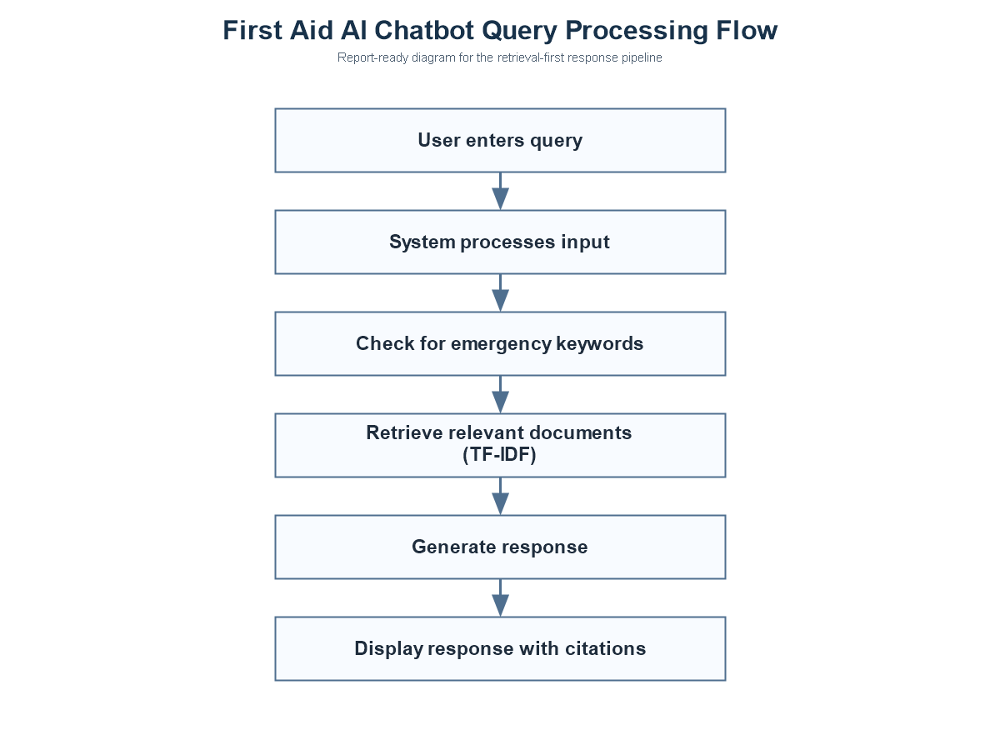
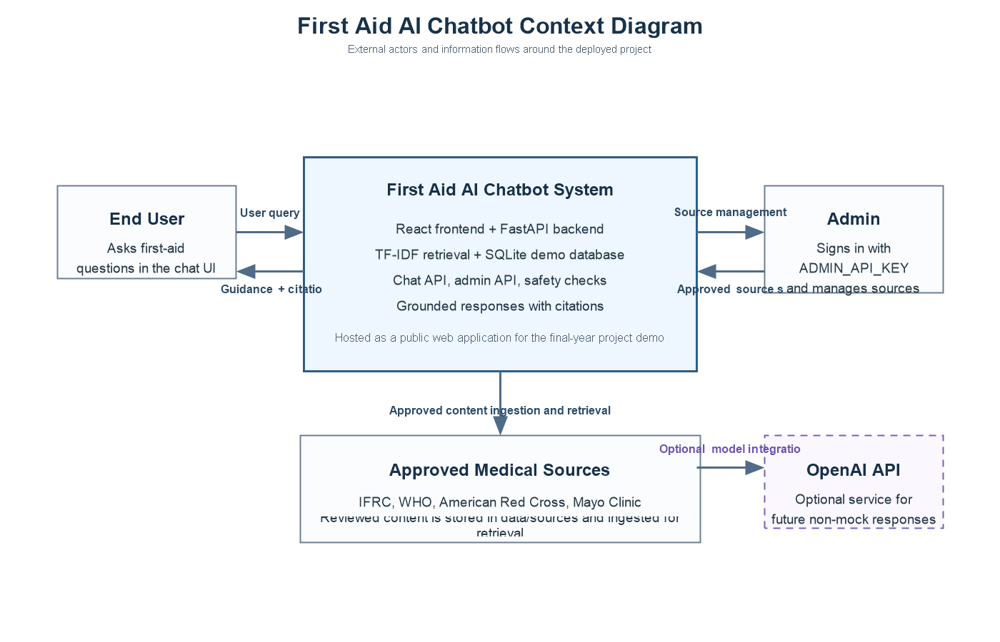

# System Architecture

## Overview

The system follows a retrieval-first architecture:

`User -> React frontend -> FastAPI backend -> safety check -> approved-source retrieval -> grounded answer formatting -> cited response`

## Flowchart Diagram

## Context Diagram

This design is safer than relying on general model memory because the assistant can answer only from approved content that has been ingested into the system.

In simple terms:

- the frontend collects the question
- the backend checks whether the question sounds dangerous
- retrieval finds matching approved medical passages
- the answer formatter turns those passages into readable first-aid steps
- the response is returned together with citations and emergency flags

## Frontend

The frontend is built in `React + TypeScript` and provides:

- chat page for user questions
- emergency banner for high-risk cases
- source/citation cards
- admin/source-management page for approved content review

Main frontend files:

- [`frontend/src/pages/ChatPage.tsx`](/c:/Users/Ethel/Desktop/FirstAidChatbotProject/frontend/src/pages/ChatPage.tsx)
- [`frontend/src/pages/AdminPage.tsx`](/c:/Users/Ethel/Desktop/FirstAidChatbotProject/frontend/src/pages/AdminPage.tsx)
- [`frontend/src/components/ChatWindow.tsx`](/c:/Users/Ethel/Desktop/FirstAidChatbotProject/frontend/src/components/ChatWindow.tsx)
- [`frontend/src/components/EmergencyBanner.tsx`](/c:/Users/Ethel/Desktop/FirstAidChatbotProject/frontend/src/components/EmergencyBanner.tsx)
- [`frontend/src/components/SourceCitations.tsx`](/c:/Users/Ethel/Desktop/FirstAidChatbotProject/frontend/src/components/SourceCitations.tsx)

## Backend

The backend is built in `FastAPI` and handles:

- `/chat` endpoint for question answering
- `/admin/sources` routes for source management
- emergency detection
- retrieval ranking over approved document chunks
- grounded response generation
- local persistence through SQLAlchemy models

Main backend files:

- [`backend/app/main.py`](/c:/Users/Ethel/Desktop/FirstAidChatbotProject/backend/app/main.py)
- [`backend/app/services/chat_service.py`](/c:/Users/Ethel/Desktop/FirstAidChatbotProject/backend/app/services/chat_service.py)
- [`backend/app/services/retrieval_service.py`](/c:/Users/Ethel/Desktop/FirstAidChatbotProject/backend/app/services/retrieval_service.py)
- [`backend/app/services/llm_service.py`](/c:/Users/Ethel/Desktop/FirstAidChatbotProject/backend/app/services/llm_service.py)
- [`backend/app/services/safety_service.py`](/c:/Users/Ethel/Desktop/FirstAidChatbotProject/backend/app/services/safety_service.py)

## Retrieval Layer

The retrieval layer currently uses local `TF-IDF` ranking over approved source chunks stored in the database.

This means the project does not yet use semantic embeddings in production. Instead, it uses:

- text chunking
- query expansion
- synonym and typo hints
- source-priority rules

Key points:

- source documents are chunked during ingestion
- each chunk is associated with source metadata
- query expansion and synonym hints improve matching for emergency phrasing
- retrieval prefers `IFRC` and `WHO` over supporting sources when both match

This is implemented mainly in:

- [`backend/app/services/retrieval_service.py`](/c:/Users/Ethel/Desktop/FirstAidChatbotProject/backend/app/services/retrieval_service.py)

## Source Ingestion

Approved content enters the system through:

- canonical approved source files in [`data/sources`](/c:/Users/Ethel/Desktop/FirstAidChatbotProject/data/sources)

Supporting scripts:

- [`scripts/ingest_sources.py`](/c:/Users/Ethel/Desktop/FirstAidChatbotProject/scripts/ingest_sources.py)

## Safety Flow

Before presenting the final answer:

1. the backend checks for emergency indicators
2. retrieval finds approved source passages
3. emergency prompts trigger a Ghana-specific warning path
4. the assistant still returns grounded first-aid steps when source content exists
5. unsupported prompts are refused safely

This order matters because the system should never produce a calm-looking answer first and only later decide that the case was an emergency.

## Data Model

Key database records include:

- source documents
- document chunks
- chat logs
- audit logs

These support explainability, traceability, and later evaluation.
